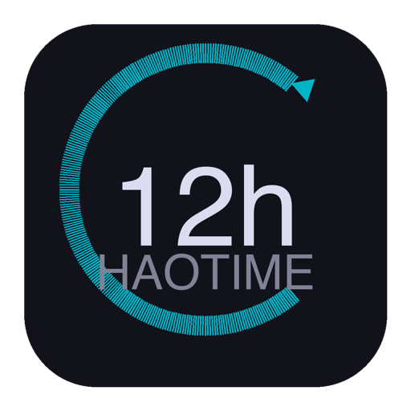

# HaoTime

**Apple Watch 风格的时间追踪 App · macOS + iOS 双平台 · iCloud 同步**

---

## 功能

- **⌚ 圆环计时** — 点击类别开始计时，再次点击停止，时长填充多色圆环（12h 满环）
- **🎨 自定义类别** — 预设 4 个（写作/思考/杂事/运动），可增删改排序，8 色 + 12 图标可选
- **📊 数据可视化** — 今日圆环 + 横向柱状图，Mac 7 列周视图 + iOS 卡片列表
- **🔄 多周历史** — 左右滑动查看历史周，Mac 滚轮翻阅 + iOS 分页
- **☁️ iCloud 同步** — SwiftData + CloudKit，Mac 记录、iPhone 即时看到
- **✨ 计时动画** — 点击按钮平滑过渡，变大居中，其他按钮隐藏

## 截图

| macOS | iOS |
|-------|-----|
| 7列周视图 + 今日详情 + 计时栏 | 卡片列表 + 分页周视图 + 计时动画 |

## 技术栈

- **UI** — SwiftUI（单 Target 双平台）
- **存储** — SwiftData（本地 SQLite）
- **同步** — CloudKit（iCloud）
- **最低版本** — iOS 17.0 / macOS 14.0

## 快速开始

1. `git clone https://github.com/okjunhaosibs-coder/HaoTime.git`
2. Xcode 打开 `HaoTime.xcodeproj`
3. Team 选你的 Apple ID
4. **Cmd+R** 运行

## iCloud 同步

如需启用跨设备同步：

1. Xcode → Target HaoTime → Signing & Capabilities → `+` → iCloud → CloudKit
2. 将 HaoTimeApp.swift 中 modelContainer 改为 `.modelContainer(for: [Category.self, Session.self])`
3. 需要 Apple 付费开发者账号（$99/年）

## 许可证

MIT
